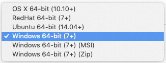

## Install MongoDB Compass

Compass is the GUI for MongoDB. It enables you to visually explore your data, run ad hoc queries in seconds and interact with your data with full CRUD functionality. View and optimize your query performance. Available on Linux, Mac, or Windows. Compass empowers you to make smarter decisions about indexing, document validation, and more.

Visit [https://mongodb.com/download-center/compass/](https://mongodb.com/download-center/compass/) to download compass.

Select the Version and Platform for your laptop or desktop computer.

Be certain to select the latest stable version of Compass for this workshop.

Also, if you lack the administrative privileges to install software on your Windows laptop, select the Windows 64-bit (7+) option, which is the executable. 

Once Compass is downloaded and installed. Launch Compass and then go back to your Atlas Console - where we'll grab the details we'll need in order to connect Compass to Atlas.